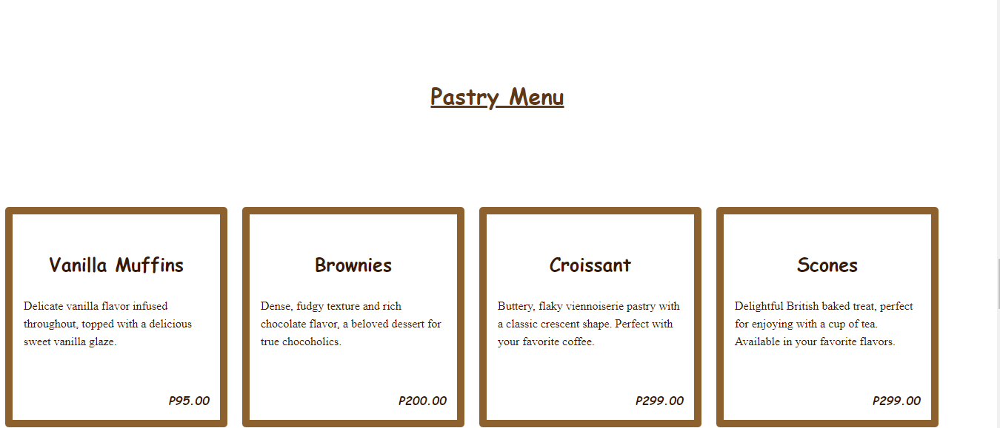
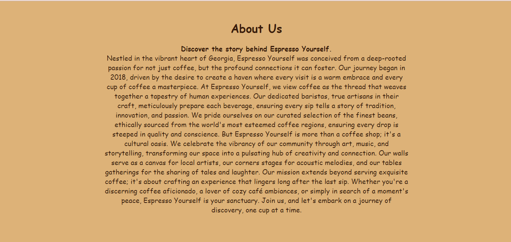
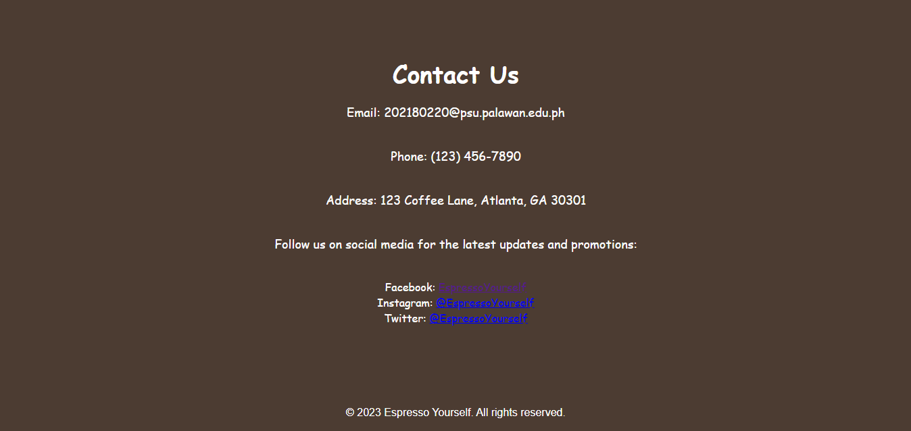

# Project Description,
About Us
    Discover the story behind Espresso Yourself.

Nestled in the vibrant heart of Georgia, Espresso Yourself was conceived from a deep-rooted passion for not just coffee, but the profound connections it can foster. Our journey began in 2018, driven by the desire to create a haven where every visit is a warm embrace and every cup of coffee a masterpiece.

At Espresso Yourself, we view coffee as the thread that weaves together a tapestry of human experiences. Our dedicated baristas, true artisans in their craft, meticulously prepare each beverage, ensuring every sip tells a story of tradition, innovation, and passion. We pride ourselves on our curated selection of the finest beans, ethically sourced from the world's most esteemed coffee regions, ensuring every drop is steeped in quality and conscience.

But Espresso Yourself is more than a coffee shop; it's a cultural oasis. We celebrate the vibrancy of our community through art, music, and storytelling, transforming our space into a pulsating hub of creativity and connection. Our walls serve as a canvas for local artists, our corners stages for acoustic melodies, and our tables gatherings for the sharing of tales and laughter.

Our mission extends beyond serving exquisite coffee; it's about crafting an experience that lingers long after the last sip. Whether you're a discerning coffee aficionado, a lover of cozy café ambiances, or simply in search of a moment's peace, Espresso Yourself is your sanctuary.

Join us, and let's embark on a journey of discovery, one cup at a time...
 ***

 # Features
* This is Home
* This is Menu
* This is About Us
* This is Contact
 *** 
# Screen Capture

The image appears to be a sticker design featuring a well-crafted cup of coffee. The coffee has a latte art design on top, resembling a heart within a heart, signifying a love for coffee or the care put into making it. Accompanying the cup is a spoon and a small, heart-shaped biscuit or chocolate on the saucer, enhancing the warm and inviting theme of the design. This could serve as a cozy and appealing logo for a café or coffee shop, emphasizing a friendly and crafted atmosphere.

The image showcases a "Pastry Menu" with a selection of baked goods offered at a café or bakery. The items listed include Vanilla Muffins, described as having a delicate vanilla flavor with a sweet glaze, priced at 95.00; Brownies, noted for their dense, fudgy texture and rich chocolate flavor, priced at 200.00; Croissants, buttery and flaky, priced at 299.00; and Scones, described as a delightful British treat perfect with tea, also at 299.00. The menu has a clean, straightforward layout with a warm color scheme, emphasizing the items and their prices clearly.

The image displays a "Contact Us" page with an elegant and minimalist design. It contains contact information for a business named "Espresso Yourself," including an email address, phone number, and physical address located on Coffee Lane in Atlanta, GA. It also invites customers to follow their social media accounts on Facebook, Instagram, and Twitter for updates and promotions, with the handle "@EspressoYourself" for each platform. The color scheme is simple, featuring text on a plain background. There is a copyright notice at the bottom dating the content to 2023.

The image is an "About Us" section from Espresso Yourself's website, conveying the coffee shop's ethos and origins. Established in 2018 in Georgia, the shop emphasizes the creation of meaningful connections through coffee. It's presented as more than a café, describing itself as a community hub for art, music, and storytelling, with a commitment to quality and ethically sourced coffee beans. The tone is warm and inviting, suggesting that Espresso Yourself offers a sanctuary for coffee lovers and a space to create lasting memories.
